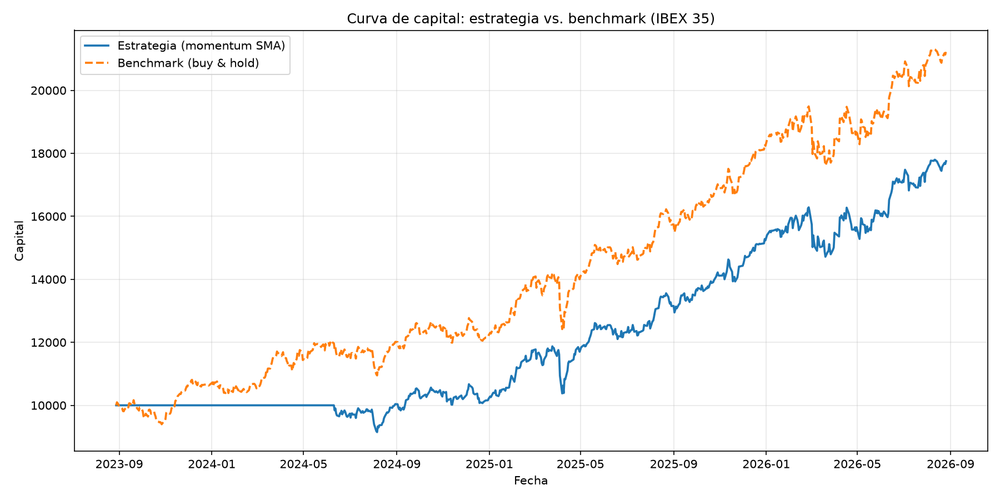
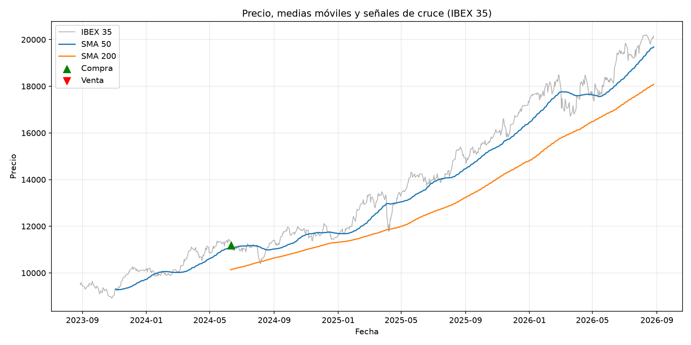

# 📈 Momentum Backtest

> A moving-average crossover strategy, simulated day by day by hand — no `backtrader`, no `bt` — to truly understand the mechanics of a backtest, not just its result.


---

## What it does

Simulates a **moving-average crossover** strategy (SMA 50 / SMA 200, "golden cross" / "death cross") on the IBEX 35, computes its metrics (annualized return, Sharpe Ratio, max drawdown) and compares it against a **buy & hold** benchmark on the same asset and period. The entire day-by-day simulation is hand-written with vectorized `pandas` — deliberately without any backtesting library, because the goal is to be able to defend the mechanism, not just the result.

## Dashboard preview

| Equity curve | Price, SMA & signals |
|---|---|
|  |  |

The full interactive version is in [`outputs/dashboard.html`](outputs/dashboard.html): just double-click to open it, no server required.

## Project structure

Unlike [Market Data Analytics](https://github.com/mariatejedorg/market-data-analytics), here `src/` is organized by backtest stage instead of a flat pipeline, and the strategy parameters live separately from the code in `config/`:

```
momentum-backtest/
├── README.md
├── requirements.txt
├── config/
│   └── strategy.py       <- ticker, SMA windows, initial capital, risk-free rate
├── data/                 <- cached downloaded prices (prices.csv)
├── notebooks/            <- Jupyter exploration
├── src/
│   ├── data.py             <- price download & caching (yfinance)
│   ├── signals.py           <- moving averages and crossover signal (with anti-look-ahead shift)
│   ├── backtest.py           <- vectorized portfolio simulation, no backtesting libraries
│   ├── metrics.py              <- annualized return, hand-computed Sharpe Ratio, max drawdown
│   ├── visualize.py             <- static charts (matplotlib) -> outputs/*.png
│   ├── dashboard.py              <- interactive dashboard (Plotly) -> outputs/dashboard.html
│   └── main.py                    <- orchestrates the whole pipeline
└── outputs/              <- generated charts and dashboard
```

## How to run it

```bash
python -m venv venv
source venv/bin/activate  # on Windows: venv\Scripts\activate
pip install -r requirements.txt
python src/main.py
```

On completion, the console prints the strategy-vs-benchmark comparison, and the following are generated in `outputs/`: `curva_capital.png`, `precio_senales.png` and `dashboard.html`.

### A note on SSL certificates
Same mechanism as in Market Data Analytics: if `yfinance` fails with `CERTIFICATE_VERIFY_FAILED` (typical with antivirus software that inspects HTTPS traffic, e.g. Norton), `src/data.py` automatically uses a local certificate bundle at `.certs/cacert.pem` if present.

## Strategy logic

| Element | Detail |
|---|---|
| Asset | IBEX 35 (`^IBEX`), configurable in `config/strategy.py` |
| Signal | SMA 50 > SMA 200 → in the market (long position); SMA 50 < SMA 200 → out of the market. No short selling. |
| Anti-look-ahead | The signal computed from day *t*'s close is applied to day *t+1*'s return (`signal.shift(1)`) — information that didn't yet exist at the session open is never used. |
| Simulation | `strategy_return = shifted_signal × daily_asset_return`, vectorized with pandas, no day-by-day loop and no backtesting library. |
| Benchmark | Buy & hold of the same asset, same period, same initial capital. |

## Results
_(over the last ~3 years of data, as of the run date)_

| Metric | Strategy | Benchmark |
|---|---|---|
| Annualized return | +20.8% | +28.2% |
| Annualized volatility | 13.8% | 15.2% |
| Sharpe Ratio | 1.50 | 1.85 |
| Maximum drawdown | -12.6% | -12.6% |
| Trades executed | 1 | — |

## Key findings

- **The benchmark beat the strategy** over this specific period (+28.2% vs. +20.8% annualized): the IBEX 35 was in a sustained uptrend from the very first day the SMA 200 became available, so the strategy only executed **one** entry (golden cross) and stayed out of the market during the first ~200-day "warm-up" of the long moving average — missing that part of the rally with no offsetting reduction in risk, since there was never a correction sharp enough to trigger a death cross.
- The maximum drawdown is **identical** across both series (-12.6%): once in the market, the strategy never exited again, so it exactly replicated the benchmark's behavior during the sharpest decline of the period. This illustrates a point worth being able to defend in an interview: a momentum strategy **does not eliminate market risk while positioned** — it only decides when to enter and exit.
- An honest, expected result: in trending bull markets without sharp corrections, a moving-average crossover strategy tends to lag buy & hold because it always reacts with a delay (it uses past data) and pays the cost of being out of the market early on. This is exactly the kind of out-of-sample behavior that makes it dangerous to settle for backtests over a single period/asset.

## Concepts to be able to explain in an interview

- **Look-ahead bias**: why the signal must be shifted by one day (`shift(1)`) before being applied to the return — otherwise the strategy would "know," at the session open, something that in reality isn't known until the close.
- **Sharpe Ratio**: what it measures (return adjusted for total risk, not just tail risk) and its limitations — it penalizes upside volatility the same as downside volatility, and says nothing about specific drawdowns.
- **Why a good backtest doesn't guarantee future results**: overfitting to a specific period/asset, sensitivity to the chosen SMA windows, and the fact that a single parameter combination tested on a single market isn't robust evidence.
